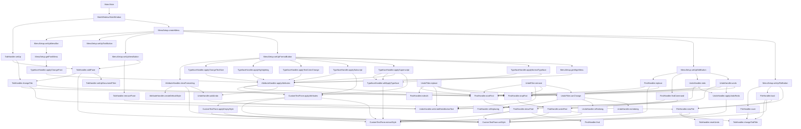

```mermaid
graph

    Main.Main --> MainWindow.MainWindow
    MainWindow.MainWindow --> MenuSetup.createMenu
    MainWindow.MainWindow --> TabHandler.setUp
    
%%    mainWindow --> documentCommand
%%    mainWindow --> tabHandler_setUp

    
    MenuSetup.createMenu --> MenuSetup.setUpFileButton
    MenuSetup.createMenu --> MenuSetup.setUpEditButton
    MenuSetup.createMenu --> MenuSetup.setUpFormatButton
    MenuSetup.createMenu --> MenuSetup.setUpViewButton
    MenuSetup.createMenu -->  MenuSetup.setUpToolButton
    MenuSetup.createMenu -->  MenuSetup.setUpMenuBar
    MenuSetup.setUpViewButton --> TabHandler.addPane
    MenuSetup.setUpViewButton --> TabHandler.removePane
    MenuSetup.setUpMenuBar --> MenuSetup.getFontMenu
    MenuSetup.setUpFormatButton -->  MenuSetup.getAlignMenu
    MenuSetup.setUpFormatButton --> TypefaceHandler.applyNormalTypeface
    MenuSetup.setUpFormatButton --> TypefaceHandler.applySuperscript
    MenuSetup.setUpFormatButton --> TypefaceHandler.applySubscript
    MenuSetup.setUpFormatButton --> TypefaceHandler.applyTextColorChange
    MenuSetup.setUpFormatButton --> TypefaceHandler.applyHighlighting
    MenuSetup.setUpFormatButton --> TypefaceHandler.applyChangeTextSize
    MenuSetup.setUpFormatButton --> AttributeHandler.clearFormatting
    MenuSetup.setUpFileButton --> FileHandler.newFile
    MenuSetup.setUpFileButton --> FileHandler.load
    MenuSetup.setUpFileButton --> FileHandler.save
    MenuSetup.setUpEditButton --> UndoHandler.undo
    MenuSetup.setUpEditButton --> UndoHandler.redo
    MenuSetup.setUpEditButton --> FindHandler.findCommand
    MenuSetup.setUpEditButton --> FindHandler.replace
    MenuSetup.getAlignMenu --> AttributeHandler.applyAttributes
    MenuSetup.getFontMenu --> TypefaceHandler.applyChangeFont
    
    
    AttributeHandler.applyAttributes --> FindHandler.stopFind
    AttributeHandler.applyAttributes --> UndoHandler.addUndo
    AttributeHandler.applyAttributes --> CustomTextPane.applyAttributes
    AttributeHandler.applyAttributes --> FindHandler.startFind
    AttributeHandler.clearFormatting --> UndoHandler.addUndo
    AttributeHandler.clearFormatting --> CustomTextPane.setStyle
    AttributeHandler.clearFormatting --> AttributeHandler.createDefaultStyle
    
    
    CustomTextPane.applyAttributes --> CustomTextPane.extractStyle
    CustomTextPane.applyAttributes --> CustomTextPane.setStyle
    CustomTextPane.applyAttributes --> CustomTextPane.applyEmptyStyle
    CustomTextPane.applyEmptyStyle --> CustomTextPane.extractStyle
    CustomTextPane.applyEmptyStyle --> CustomTextPane.setStyle
    
    
    TypefaceHandler.applySuperscript --> CustomTextPane.applyAttributes
    TypefaceHandler.applySuperscript --> AttributeHandler.applyAttributes
    TypefaceHandler.applySuperscript --> TypefaceHandler.willApplyTypeface
    TypefaceHandler.applyNormalTypeface --> AttributeHandler.applyAttributes
    TypefaceHandler.applyNormalTypeface --> TypefaceHandler.willApplyTypeface
    TypefaceHandler.applySubscript --> CustomTextPane.applyAttributes
    TypefaceHandler.applySubscript --> AttributeHandler.applyAttributes
    TypefaceHandler.applySuperscript --> TypefaceHandler.willApplyTypeface
    TypefaceHandler.willApplyTypeface --> CustomTextPane.extractStyle
    TypefaceHandler.applyHighlighting --> AttributeHandler.applyAttributes
    TypefaceHandler.applyTextColorChange --> AttributeHandler.applyAttributes
    TypefaceHandler.applyChangeFont --> AttributeHandler.applyAttributes
    TypefaceHandler.applyChangeTextSize --> AttributeHandler.applyAttributes

    TabHandler.setUp --> TabHandler.changeTab
    TabHandler.setUp --> TabHandler.addPane
    TabHandler.addPane --> TabHandler.setUpDocumentFilter
    TabHandler.addPane --> CustomTextPane.setStyle
    TabHandler.addPane --> TabHandler.changeTab
    TabHandler.removePane --> FileHandler.newFile
    TabHandler.changeTab --> FindHandler.stopFind
    TabHandler.changeTab --> UndoHandler.setUndoRedoButtonText
    TabHandler.changeTab --> FindHandler.startFind
    
%%    command --> applySubscript
%%    command --> applySuperscript
%%    command --> applyNormalTypeface
%%    command --> redo
%%    command --> undo
%%    documentCommand --> replace
%%    documentCommand --> remove
    
    UndoFilter.replace --> UndoFilter.canChange
    UndoFilter.replace --> FindHandler.stopFind
    UndoFilter.replace --> UndoHandler.setUndoRedoButtonText
    UndoFilter.replace --> FindHandler.indexAt
    UndoFilter.replace --> FindHandler.startFind
    UndoFilter.remove --> UndoFilter.canChange
    UndoFilter.remove --> FindHandler.stopFind
    UndoFilter.remove --> UndoHandler.setUndoRedoButtonText
    UndoFilter.remove --> FindHandler.startFind
    UndoFilter.canChange --> UndoHandler.isUndoing
    UndoFilter.canChange --> UndoHandler.isRedoing
    UndoFilter.canChange --> FindHandler.isReplacing
    
    UndoHandler.undo --> FindHandler.stopFind
    UndoHandler.undo --> UndoHandler.applyUndoRedo
    UndoHandler.undo --> FindHandler.startFind
    UndoHandler.undo --> UndoHandler.setUndoRedoButtonText
    UndoHandler.redo --> FindHandler.stopFind
    UndoHandler.redo --> UndoHandler.applyUndoRedo
    UndoHandler.redo --> FindHandler.startFind
    UndoHandler.redo --> UndoHandler.setUndoRedoButtonText
    UndoHandler.addUndo --> UndoHandler.setUndoRedoButtonText
    UndoHandler.applyUndoRedo --> CustomTextPane.setStyle

    FileHandler.save --> TabHandler.changeTabTitle
    FileHandler.load --> FileHandler.newFile
    FileHandler.load --> CustomTextPane.setStyle
    FileHandler.load --> TabHandler.changeTabTitle
    FileHandler.newFile --> CustomTextPane.setStyle
    FileHandler.newFile --> TabHandler.resetUndo
    FileHandler.newFile --> TabHandler.changeTabTitle

    FindHandler.stopFind --> FindHandler.undoFind
    FindHandler.startFind --> FindHandler.showFind
    FindHandler.findCommand --> FindHandler.showFind
    FindHandler.findCommand--> FindHandler.undoFind
    FindHandler.replace --> FindHandler.stopFind
    FindHandler.replace--> CustomTextPane.extractStyle
    FindHandler.replace --> FindHandler.startFind
    FindHandler.showFind --> FindHandler.find
    FindHandler.showFind --> CustomTextPane.extractStyle
    FindHandler.showFind --> CustomTextPane.setStyle
    FindHandler.undoFind --> CustomTextPane.extractStyle
    FindHandler.undoFind --> CustomTextPane.setStyle

```